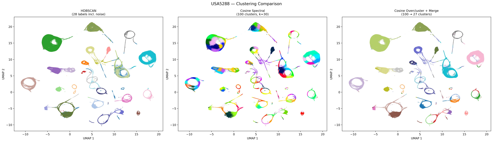

# gpu-spectral-clustering

GPU-accelerated spectral clustering using PyTorch. No RAPIDS/cuML dependency — just PyTorch for the GPU k-NN kernel and scipy/sklearn for sparse eigen and KMeans.

## Motivation

Standard spectral clustering (e.g. `sklearn.cluster.SpectralClustering`) scales poorly beyond a few thousand points because it builds a dense affinity matrix and performs a full eigendecomposition. On 10K points it takes ~14 seconds; extrapolating its O(n^2.85) scaling to 1M points yields an estimated runtime of months.

This library replaces the expensive steps with GPU-accelerated alternatives:

- **k-NN affinity** instead of a full pairwise affinity matrix, stored as a sparse CSR matrix.
- **Batched GPU k-NN** via `torch.cdist`, keeping memory at O(batch_size x n) instead of O(n^2).
- **Two approximate variants** (Nystrom and Two-stage) that reduce the eigendecomposition to a small subsample, enabling spectral clustering on 10M+ points in seconds.

## Differences from sklearn SpectralClustering

The mathematical framework is standard spectral clustering (affinity graph, normalized Laplacian, eigen-embedding, KMeans). The key differences are engineering choices that enable the ~1000x speedup at scale:

### Sparse k-NN affinity instead of dense RBF affinity

sklearn builds a **dense** n x n affinity matrix using a Gaussian RBF kernel between *every* pair of points — O(n^2) memory and computation. This library builds a **sparse** affinity matrix by only connecting each point to its `n_neighbors` nearest neighbors, stored in CSR format with O(n * k) nonzero entries.

### GPU-batched k-NN instead of CPU pairwise distances

sklearn computes pairwise distances on CPU via numpy/scipy. This library does it on GPU using `torch.cdist` in batches of `batch_size` query rows at a time, keeping peak GPU memory at O(batch_size * n) rather than O(n^2).

### Adaptive bandwidth via median heuristic

sklearn uses a fixed `gamma` parameter for the RBF kernel (defaulting to `1/n_features`). This library sets sigma automatically to the **median of all k-NN distances**, a common heuristic that adapts to the data's intrinsic scale without tuning.

### Equivalent Laplacian formulation

Both use the symmetric normalized Laplacian, but with a minor algebraic shortcut:

- sklearn computes **L = I - D^{-1/2} W D^{-1/2}** and finds the *smallest* eigenvectors (closest to 0).
- This library computes **L = D^{-1/2} W D^{-1/2}** (omitting the I -) and finds the *largest* eigenvectors via `eigsh(..., which='LM')`.

These are mathematically equivalent — the largest eigenvectors of D^{-1/2} W D^{-1/2} correspond to the smallest eigenvectors of I - D^{-1/2} W D^{-1/2}.

### What stays the same

- **Sparse eigendecomposition**: Both use `scipy.sparse.linalg.eigsh` (ARPACK).
- **Row-normalization + KMeans**: Both L2-normalize the eigenvector embedding and run KMeans to get final labels (the Ng-Jordan-Weiss recipe).

## Package structure

```
gpu_spectral/
├── __init__.py       # Public API: imports all classes and functions
├── knn.py            # GPU k-NN primitives (gpu_knn, gpu_knn_cross)
├── spectral.py       # Clustering classes (GPUSpectral, NystromSpectral, TwoStageSpectral)
└── merge.py          # Transition-based cluster merging for sequential data
```

- **`knn.py`** contains two functions that are the GPU workhorses. They move data to the GPU, compute L2 distances in batches using `torch.cdist`, extract top-k nearest neighbors via `torch.topk`, and return numpy arrays. The batch loop ensures that only `batch_size` rows of the full distance matrix are materialized at once.

- **`spectral.py`** implements three clustering classes plus the shared `spectral_core` function. Each class follows the scikit-learn convention of exposing a `.fit_predict(X)` method that accepts a numpy array and returns integer cluster labels.

- **`merge.py`** provides post-hoc cluster merging for sequential/temporal data. When spectral clustering over-segments (e.g. splitting one state into multiple phase-based sub-clusters), this module identifies which clusters should be merged by analyzing how frequently the system transitions between them.

## Installation

```bash
git clone https://github.com/timothyjgardner/gpu_spectral_clustering.git
cd gpu_spectral_clustering
pip install -e .
```

Requires:
- Python >= 3.9
- PyTorch with CUDA support
- numpy, scipy, scikit-learn

## Methods

| Class | Strategy | Practical scale |
|---|---|---|
| `GPUSpectral` | Full spectral with GPU k-NN | ~100K points |
| `NystromSpectral` | Nystrom landmark approximation | ~1M points |
| `TwoStageSpectral` | Subsample + k-NN propagation | 10M+ points |

### Full spectral (`GPUSpectral`)

Standard spectral clustering with the k-NN affinity graph constructed on GPU. This is the reference implementation that the two approximate methods build on.

**Algorithm:**

1. **GPU k-NN** (`knn.py: gpu_knn`): For each of the *n* points, find the `n_neighbors` nearest neighbors. The full dataset is uploaded to GPU once. Then, in a loop over batches of query rows, `torch.cdist` computes the L2 distance from each query to all *n* points, producing a (batch_size x n) matrix. Self-distances within the batch are set to infinity, and `torch.topk` extracts the *k* smallest. This keeps peak GPU memory at O(batch_size x n) rather than O(n^2).

2. **Affinity graph**: The k-NN distances are converted to affinities using a Gaussian (RBF) kernel. The bandwidth sigma is set automatically to the median of all k-NN distances across the dataset — this is a common heuristic that adapts to the data scale without tuning. The result is a sparse *n x n* affinity matrix *W* stored in CSR format. The matrix is symmetrized as W = (W + W^T) / 2 since k-NN is not symmetric (point *i*'s neighbor *j* may not have *i* as a neighbor).

3. **Normalized Laplacian**: The symmetric normalized Laplacian L = D^{-1/2} W D^{-1/2} is computed, where D is the diagonal degree matrix (row sums of W). This normalization ensures that the clustering is invariant to the density of points in each cluster.

4. **Eigen decomposition**: The top-*k* eigenvectors of L are extracted using `scipy.sparse.linalg.eigsh` (ARPACK). Because L is sparse, this is much faster than a dense eigendecomposition, but it still becomes the bottleneck beyond ~100K points.

5. **KMeans**: The eigenvectors are L2-normalized row-wise (projecting each point onto the unit sphere), then clustered with `sklearn.cluster.KMeans` (n_init=10 for stability).

**When to use:** Datasets up to ~100K points where you want the highest quality clustering. Beyond this, the sparse eigendecomposition becomes slow.

### Nystrom approximation (`NystromSpectral`)

The Nystrom method avoids the expensive n x n eigendecomposition by working with a smaller set of *m* landmark points and then extending the solution to all *n* points using the Nystrom out-of-sample formula.

**Algorithm:**

1. **Sample landmarks**: Randomly select `n_landmarks` (= *m*) points from the dataset.

2. **Spectral on landmarks**: Build the m x m affinity graph on just the landmark points (using `gpu_knn`), compute its normalized Laplacian, and extract *k* eigenvectors V_m with eigenvalues lambda_1, ..., lambda_k. This is the same pipeline as `GPUSpectral` but on a much smaller matrix.

3. **Cross-affinity**: Compute the affinity between all *n* points and the *m* landmarks. First, `gpu_knn_cross` finds each point's `n_neighbors` nearest landmarks on GPU. Then, the actual L2 distances to those landmarks are computed (again batched on GPU), and converted to Gaussian weights using the same sigma from step 2. This produces a sparse *n x m* cross-affinity matrix W_nm.

4. **Nystrom extension**: Extend the landmark eigenvectors to all points:

   V_n = W_nm * V_m * diag(1 / lambda)

   Intuitively, each point's extended eigenvector is a weighted average of its nearby landmarks' eigenvectors, scaled by the inverse eigenvalue. Points close to a landmark inherit that landmark's spectral embedding; points between landmarks interpolate.

5. **KMeans**: L2-normalize the extended eigenvectors and run KMeans.

**Key parameter:**

- `n_landmarks` (default: 5000) — How many landmark points to sample. The eigendecomposition runs on an m x m matrix, so this controls the quality-speed tradeoff:
  - **Too few** (< 1000): Landmarks may not represent all cluster boundaries, leading to misassigned points.
  - **Sweet spot** (2000-10000): Captures the cluster structure well. 5000 landmarks is sufficient for most datasets.
  - **Too many** (> 20000): The landmark eigendecomposition itself becomes slow, negating the benefit of the approximation.

**Complexity:** The eigendecomposition is O(m^2) instead of O(n^2). The cross-affinity step is O(n x m) but runs on GPU. Total: O(m^2 + n x m), making it practical for ~1M points.

**Quality:** Very close to full spectral when landmarks adequately cover the data. The Nystrom formula is mathematically grounded — it produces the exact eigenvectors in the limit where all points are landmarks.

### Two-stage subsample + propagate (`TwoStageSpectral`)

The simplest and fastest approximation. It runs exact spectral clustering on a small random subsample, then assigns every remaining point to the cluster of its nearest subsampled neighbor.

**Algorithm:**

1. **Sample**: Randomly select `n_subsample` (= *m*) points from the dataset.

2. **Exact spectral on subsample**: Run `spectral_core` (the full `GPUSpectral` pipeline) on the *m* subsampled points to obtain cluster labels for each.

3. **Propagate via GPU k-NN**: For every point in the full dataset, find its single nearest neighbor among the *m* subsampled points using `gpu_knn_cross` with k=1. Assign it the cluster label of that nearest neighbor.

**Key parameter:**

- `n_subsample` (default: 10000) — Number of points for the exact spectral step. This controls quality and speed:
  - **Too few** (< 2000): The subsample may miss small or sparse clusters entirely.
  - **Sweet spot** (5000-20000): Dense enough to capture all clusters and their boundaries. 10000 is a good default.
  - **Too many** (> 50000): The subsample spectral step becomes the bottleneck.

**Complexity:** O(m^2) for the subsample spectral step + O(n x m) for the propagation k-NN (GPU). The propagation step has extremely small constants because it's a single nearest-neighbor lookup on GPU, making this method practical for 10M+ points.

**Tradeoff:** Points near cluster boundaries may be misassigned if the subsample doesn't densely cover the boundary. This is most noticeable when clusters overlap or have complex non-convex shapes. Increasing `n_subsample` mitigates this. For well-separated clusters, even n_subsample=5000 works well.

**When to use:** Large-scale datasets (1M+) where speed is critical and clusters are reasonably well-separated. Also useful for quick exploratory analysis before committing to a slower method.

### Shared parameters

All three methods share these parameters:

- **`n_clusters`** — Number of clusters to find. This determines the number of eigenvectors extracted and the *k* in KMeans. If unknown, you can overestimate and merge clusters afterward.

- **`n_neighbors`** (default: 30) — Number of neighbors for the k-NN affinity graph. This controls the graph's connectivity:
  - **Low values** (5-15): Sparse graph, sensitive to local structure. Good for detecting tight, well-separated clusters.
  - **Moderate values** (20-50): Good default range. Balances local detail and global connectivity.
  - **High values** (50-100+): Denser graph, captures broader structure. Useful for noisy data or when clusters have complex shapes. Increases GPU k-NN time linearly.

- **`seed`** (default: 42) — Random seed for reproducibility. Affects KMeans initialization and random subsampling/landmark selection.

### How to choose a method

1. **n < 100K** — Use `GPUSpectral` for exact results.
2. **100K < n < 2M** — Use `NystromSpectral` for near-exact quality.
3. **n > 2M** — Use `TwoStageSpectral` for speed. Consider validating on a subsample with `GPUSpectral` first.
4. **Unsure** — Start with `TwoStageSpectral` (fast feedback), then upgrade to `NystromSpectral` if quality matters.

### Transition-based cluster merging (`merge.py`)

When clustering sequential or time-series data, spectral clustering often over-segments: a single underlying state (e.g. one oscillatory mode) gets split into multiple sub-clusters representing different phases of that state. The merge module identifies and recombines these fragments.

**The key insight:** If two clusters belong to the same underlying state, the system will transition between them frequently. Clusters belonging to *different* states will have rare inter-transitions.

**Algorithm:**

1. **Build transition matrix**: Walk through the label sequence and count how often the system moves from cluster *i* to cluster *j* at consecutive timesteps. If the data is formed by concatenating fixed-length windows (e.g. from sliding-window feature extraction), transitions at window boundaries are skipped via the `seq_len` parameter to avoid counting spurious cross-window transitions.

2. **Compute transition probabilities**: Row-normalize the count matrix to get transition probabilities P[i,j] = P(next=j | current=i).

3. **Symmetrize to similarity**: Compute S = (P + P^T) / 2. This symmetrized probability serves as a similarity measure — high S[i,j] means clusters i and j frequently transition to each other in both directions.

4. **Hierarchical merging**: Convert similarity to distance (D = 1 - S), then run agglomerative clustering with average linkage (`scipy.cluster.hierarchy.linkage`) to build a merge dendrogram. Cut the dendrogram at `n_merge` groups.

5. **Relabel**: Map all original labels through the merge map to produce contiguous 0-indexed merged labels.

**Parameters:**

- `n_merge` — Target number of clusters after merging. If the original clustering found 15 clusters but the true number of states is 10, set `n_merge=10`.
- `seq_len` — Length of each contiguous window in the label sequence. Set this if your labels come from concatenated sliding windows (e.g. `seq_len=1024`). If the label sequence is one continuous stream, leave as `None`.
- `method` — Linkage method for hierarchical clustering (default: `'average'`). Other options: `'single'`, `'complete'`, `'ward'`.

**Usage:**

```python
from gpu_spectral import TwoStageSpectral, merge_clusters

# Over-cluster intentionally
labels = TwoStageSpectral(n_clusters=15, n_subsample=10000).fit_predict(X)

# Merge down to the true number of states
merged_labels, info = merge_clusters(labels, n_merge=10, seq_len=1024)

print(f"Before: {info['k_before']} clusters → After: {info['k_after']} clusters")
print(f"Merge map: {info['merge_map']}")  # merge_map[old_label] = new_label

# Transition matrices are available for visualization
T_before = info['T_before']  # (15, 15) count matrix
T_after = info['T_after']    # (10, 10) count matrix
```

**When to use:** Any time you're clustering representations extracted from sequential data (time series, text, video frames, audio) and suspect the clustering is too fine-grained. The transition structure reveals the natural groupings that pure geometry might miss.

**Lower-level access:**

```python
from gpu_spectral.merge import (
    build_transition_matrix,
    transition_to_probability,
    merge_by_transitions,
    apply_merge,
)

T = build_transition_matrix(labels, seq_len=1024)
P = transition_to_probability(T)
merge_map = merge_by_transitions(T, n_merge=10)
merged_labels = apply_merge(labels, merge_map)
```

## Quick start

```python
import numpy as np
from gpu_spectral import GPUSpectral, NystromSpectral, TwoStageSpectral

X = np.random.randn(100_000, 128).astype(np.float32)

# Full GPU spectral (best quality, up to ~100K points)
labels = GPUSpectral(n_clusters=10, n_neighbors=30).fit_predict(X)

# Nystrom approximation (up to ~1M points)
labels = NystromSpectral(n_clusters=10, n_landmarks=5000).fit_predict(X)

# Two-stage for large datasets (10M+ points)
labels = TwoStageSpectral(n_clusters=10, n_subsample=10000).fit_predict(X)
```

### Using the low-level k-NN functions directly

The GPU k-NN primitives are useful on their own for tasks beyond clustering:

```python
from gpu_spectral import gpu_knn, gpu_knn_cross

# Find 30 nearest neighbors for each point
distances, indices = gpu_knn(X, k=30, batch_size=2048)
# distances.shape == (n, 30), indices.shape == (n, 30)

# Cross-set k-NN: find nearest points in a reference set
query = np.random.randn(1000, 128).astype(np.float32)
ref = np.random.randn(50000, 128).astype(np.float32)
indices = gpu_knn_cross(query, ref, k=5)
# indices.shape == (1000, 5) — indices into ref
```

The `batch_size` parameter controls GPU memory usage. If you run out of GPU memory, reduce it (e.g. to 512 or 1024). The default of 2048 works well for 128D data on GPUs with 16+ GB VRAM.

### Clustering real data (e.g. embeddings from a neural network)

```python
import numpy as np
from gpu_spectral import TwoStageSpectral

# Load pre-computed embeddings
embeddings = np.load("my_embeddings.npy").astype(np.float32)
print(f"Clustering {embeddings.shape[0]} points in {embeddings.shape[1]}D")

# Cluster with two-stage (fast, works for any size)
clusterer = TwoStageSpectral(
    n_clusters=20,       # expected number of clusters
    n_neighbors=50,      # more neighbors for high-D data
    n_subsample=15000,   # larger subsample for better boundary coverage
)
labels = clusterer.fit_predict(embeddings)

# Evaluate with silhouette score
from sklearn.metrics import silhouette_score
sil = silhouette_score(embeddings, labels, sample_size=5000)
print(f"Silhouette score: {sil:.3f}")
```

## Benchmarks (RTX 5090, 128D)

| Points | Full GPU | Nystrom (5K landmarks) | Two-stage (10K subsample) |
|---|---|---|---|
| 100K | 0.6s | 0.3s | 0.1s |
| 1M | 90s | 4.4s | 0.8s |
| 5M | — | — | 2.1s |
| 10M | — | — | 3.7s |
| 50M | — | — | 16.6s |

For comparison, `sklearn.cluster.SpectralClustering` takes ~14 seconds on 10K points and scales as approximately O(n^2.85), making 1M+ points completely infeasible.

## API reference

### Functions

**`gpu_knn(X, k, batch_size=2048)`**

Batched GPU k-nearest-neighbor search.

- **X**: ndarray of shape (n, d), float32 recommended.
- **k**: Number of neighbors to find.
- **batch_size**: Number of query rows per GPU batch. Controls peak GPU memory (batch_size x n x 4 bytes for float32 distances).
- **Returns**: Tuple of (distances, indices), each ndarray of shape (n, k).

**`gpu_knn_cross(X_query, X_ref, k, batch_size=2048)`**

Cross-set GPU k-NN: for each query point, find k nearest in a reference set.

- **X_query**: ndarray of shape (n_q, d).
- **X_ref**: ndarray of shape (n_r, d).
- **k**: Number of neighbors.
- **batch_size**: Query batch size.
- **Returns**: ndarray of shape (n_q, k) — indices into X_ref.

**`spectral_core(X, n_clusters, n_neighbors, seed)`**

Full spectral clustering pipeline (GPU k-NN + sparse eigen + KMeans).

- **X**: ndarray of shape (n, d), float32.
- **n_clusters**: Number of clusters.
- **n_neighbors**: k-NN graph connectivity.
- **seed**: Random seed.
- **Returns**: ndarray of shape (n,) — integer cluster labels.

### Classes

All expose `.fit_predict(X)` returning integer cluster labels (ndarray of shape (n,)):

**`GPUSpectral(n_clusters, n_neighbors=30, seed=42)`**

Full GPU-accelerated spectral clustering.

**`NystromSpectral(n_clusters, n_neighbors=30, seed=42, n_landmarks=5000)`**

Nystrom-approximated spectral clustering with `n_landmarks` landmark points.

**`TwoStageSpectral(n_clusters, n_neighbors=30, seed=42, n_subsample=10000)`**

Two-stage spectral: exact spectral on `n_subsample` points, then k-NN propagation.

### Merge functions

**`merge_clusters(labels, n_merge, seq_len=None, method='average')`**

End-to-end cluster merging for sequential data. Builds a transition matrix, merges clusters by transition similarity, and relabels.

- **labels**: ndarray of shape (n,), int — cluster label per timestep.
- **n_merge**: Target number of clusters after merging.
- **seq_len**: Window length; transitions at boundaries are skipped. None for continuous sequences.
- **method**: Linkage method ('average', 'single', 'complete', 'ward').
- **Returns**: Tuple of (merged_labels, info_dict). The info dict contains `'T_before'`, `'T_after'`, `'merge_map'`, `'k_before'`, `'k_after'`.

**`build_transition_matrix(labels, seq_len=None)`**

Count transitions between consecutive labels. Returns (k, k) count matrix.

**`transition_to_probability(T)`**

Row-normalize counts to probabilities. Returns (k, k) stochastic matrix.

**`merge_by_transitions(T, n_merge, method='average')`**

Hierarchical merging on transition similarity. Returns merge_map array of shape (k,).

**`apply_merge(labels, merge_map)`**

Remap labels through a merge map. Returns relabeled array.

## Benchmark script

```bash
# Compare all three methods at multiple scales
python benchmark.py --sizes 10000,100000,1000000 --methods twostage,nystrom,full

# Test two-stage scaling at large sizes
python benchmark.py --sizes 1000000,5000000,10000000 --methods twostage

# Custom dimensionality and cluster count
python benchmark.py --sizes 100000 --dim 256 --n-clusters 20 --n-neighbors 50
```

## Acknowledgments

Vibe-coded by Claude Opus 4.6 with orchestration by Tim Gardner.

## Example: Birdsong latent space clustering



This figure compares three clustering approaches on UMAP-projected latent representations from [TweetyBERT](https://github.com/birdsonganalysis/tweetybert) (bird USA5288). The latent vectors are L2-normalized before clustering so that the GPU spectral methods operate on cosine similarity.

- **Left — HDBSCAN** (28 labels including noise): The baseline density-based clustering, run on a 6-dimensional UMAP embedding of the latent space. HDBSCAN finds variable-density clusters but leaves many points labeled as noise.

- **Center — Cosine Spectral** (100 clusters, k=30): `TwoStageSpectral` with 100 clusters on the L2-normalized latents. Over-clustering intentionally produces many small, pure clusters that respect fine-grained spectral structure.

- **Right — Cosine Overcluster + Merge** (100 → 27 clusters): The 100 spectral clusters are merged down to 27 using `merge_clusters` with transition-based similarity. File boundaries between recordings are masked so that transitions at recording edges don't create spurious merges. The result recovers coherent syllable types without noise points.

**How it was generated:**

The plot was produced by `plot_3panel_comparison.py` in the parent project directory. The key steps:

1. Load TweetyBERT latent space and pre-computed UMAP coordinates from `USA5288.npz`
2. L2-normalize the latent vectors (`sklearn.preprocessing.normalize`)
3. Run `TwoStageSpectral(n_clusters=100, n_neighbors=30, n_subsample=30000).fit_predict()` on the normalized latents
4. Merge from 100 → 27 clusters with `merge_clusters(labels, n_merge=27, boundary_mask=bmask)`, where `bmask` flags file boundaries via `boundary_mask_from_indices`
5. Plot all three labelings (HDBSCAN, over-clustered, merged) on the same UMAP coordinates

## License

MIT
